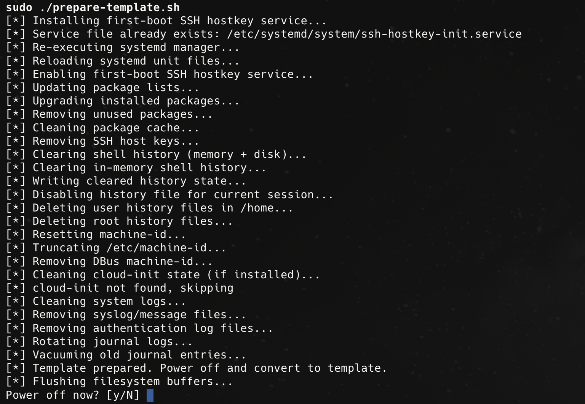

# Proxmox VM Template Preparation Script

[](LICENSE)
[](prepare-template.sh)
[](https://www.linux.org/)

## Preview



Production-ready script for preparing Linux virtual machines before converting them into clean Proxmox templates.

## Features

- Installs one-time systemd service for SSH host key regeneration on first boot
- Uses `systemd/systemd-hostkey-unit.service` as the source template for unit content
- Reuses existing service file if it already exists
- Validates required commands and fails fast with clear errors
- Removes existing SSH host keys from the template
- Removes `/var/lib/systemd/random-seed` to avoid cloned entropy state
- Clears all user shell history
- Resets machine-id
- Cleans cloud-init state (if present)
- Cleans `/tmp` and `/var/tmp` contents without removing the directories
- Updates system packages in non-interactive mode
- Performs apt cleanup (autoremove + autoclean)
- Truncates text logs under `/var/log` and vacuums journald
- Runs in quiet mode (shows step messages, hides command output)
- Writes detailed command output to `/var/log/template-prep.log`
- Asks at the end whether to power off the VM

## Why this exists

Cloned VMs must never share:

- SSH host fingerprints
- machine-id
- shell command history
- cloud-init state

This script guarantees clean, reproducible Proxmox templates.

## How it works

During template preparation:

- System is fully updated
- Cleanup operations are executed (logs, temp dirs, history, IDs, random seed)
- SSH host keys are removed
- First-boot regeneration service is installed

On first boot of each clone:

- systemd automatically generates fresh SSH host keys
- Unit runs only when no host keys exist (via `ConditionPathExistsGlob`)

## Usage

```bash
sudo ./prepare-template.sh
```

Notes:

- Run as `root` (or via `sudo`)
- Detailed step output is written to `/var/log/template-prep.log`

At the end of the run, the script asks:

```text
Power off now? [y/N]
```

- `y` / `yes`: powers off the VM
- any other input (or Enter): skips power off
- non-interactive shell: power-off prompt is skipped automatically

## License

This project is licensed under the MIT License. See `LICENSE` for details.
